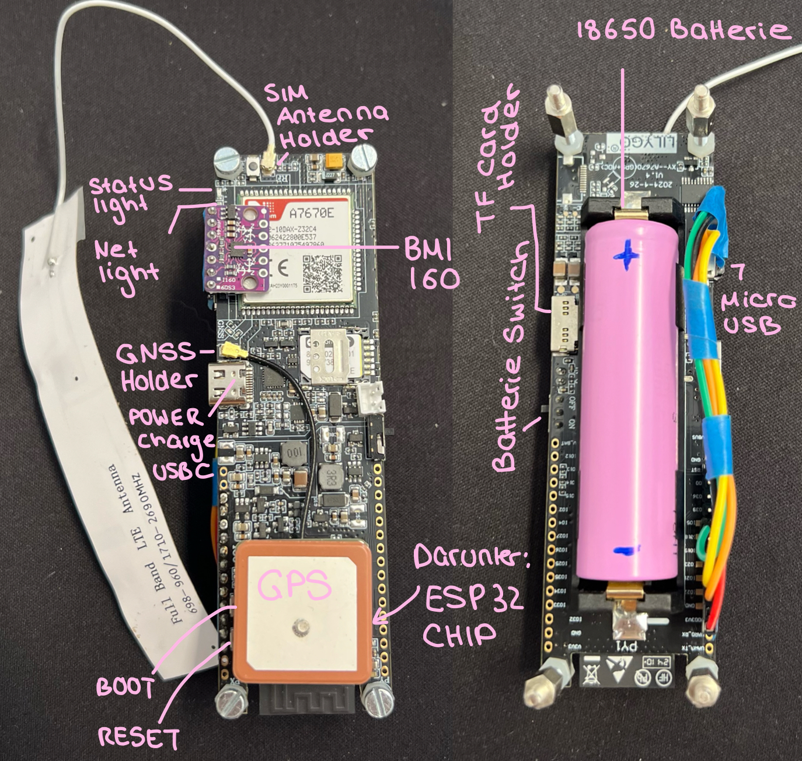
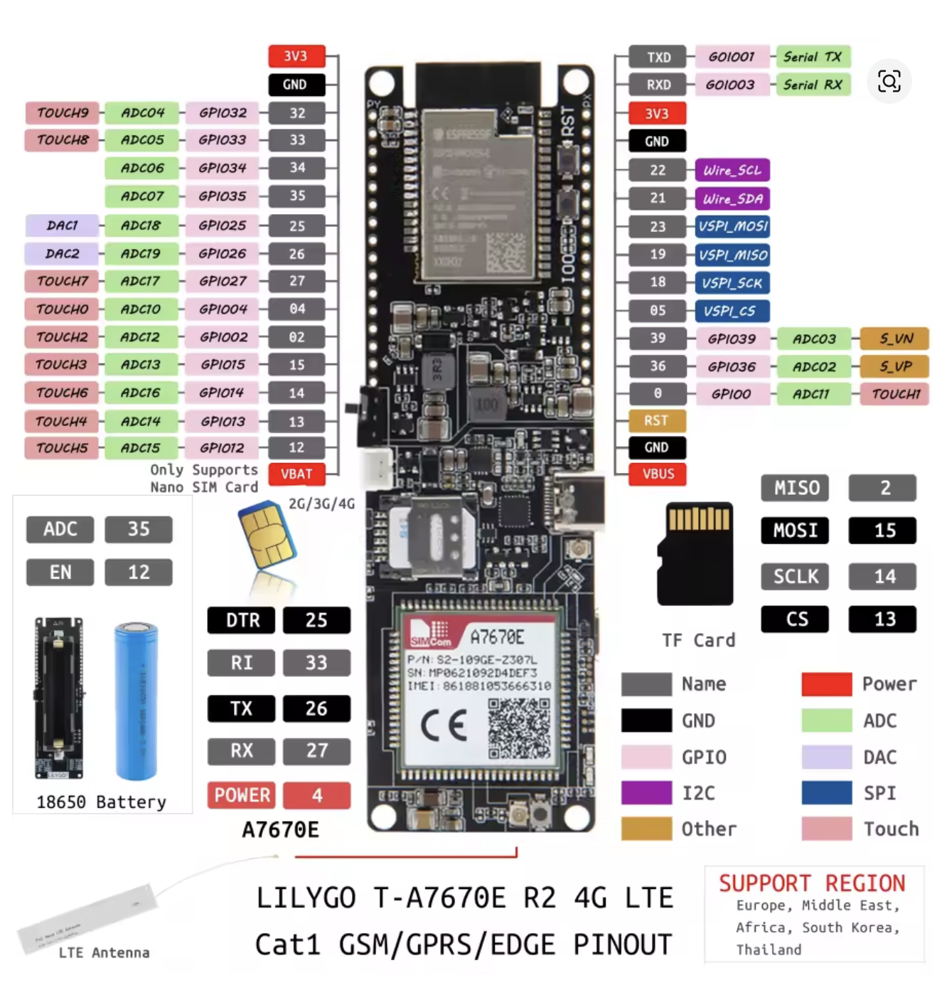

### Hardware-Setup

- **Gerät:** LILYGO® TTGO T-7670E R2 mit integriertem A7670E-Modul (4G/LTE, GPS)
- **Sensoren:**
	- **GPS** direkt im A7670E-Modul integriert, aktiviert über AT-Befehle, funktioniert ohne Internetverbindung, benötigt freie Sicht zum Himmel.
    - **BMI160** – I2C-basierter Beschleunigungs- und Gyroskop-Sensor, über Jumperkabel direkt mit dem ESP32 verbunden.
- **Kommunikation:**
    - GSM-/4G-Modul über UART, gesteuert durch AT-Befehle
    - MQTT zur Datenübertragung an den Server
- **Stromversorgung:**
    - 18650 Li-Ion-Akku (Samsung), geladen über Kraftmax BC-2000 USB
    - Akkustand wird per Spannungsteiler erfasst und in der App angezeigt
- **Gehäuse:**
	- Eigenständig konstruiert mit Solid Edge, 3D-gedruckt auf einem Bambu Lab A1

### Mikrocontroller-Code

- **Entwicklungsumgebung:** Visual Studio Code mit PlatformIO
- **Framework:** Arduino für ESP32 (espressif32@6.10.0)
- **Setup:**
    - Alle Hardwaremodule wurden zunächst einzeln getestet und anschließend in einem Gesamtprojekt zusammengeführt. (examples/DAPI_AKTUELL/dapi.cpp)
    - Code-Struktur modular aufgebaut: GPS-, Sensor-, MQTT- und Batterie-Komponenten einzeln gekapselt.
- **Funktion:**
    - Initialisierung des GSM-/GPS-Moduls und Sensoren
    - Datenaufnahme: GPS-Koordinaten, Geschwindigkeit, Beschleunigung (m/s²), Gyro (°/s), Batteriestand
    - Bewegungsanalyse anhand definierter Schwellenwerte:
	    - kleiner 2 km/h → ruhig
	    - größer 2 km/h → gehen
	    - größer 10 km/h → rennen 
	    - hohe Gyro-Werte → schütteln
    - JSON-Payload wird alle 5 Sekunden über MQTT an den Server gesendet
- **Konfiguration:**
    - Projektstruktur über `platformio.ini` definiert
    - Standardumgebung für das Board `T-A7670X` aktiviert
- **Beispielhafte MQTT-Nachricht:**
    {   "latitude": 49.123456,   "longitude": 12.123456,   "speed_kmph": 3.5,   "accel": {"x": 0.12, "y": 0.03, "z": 9.81},   "gyro": {"x": 0.5, "y": 0.2, "z": 1.1},   "aktion": "gehen",   "akku": 85 }

   

    **Probleme:**
    - GPS benötigt freie Sicht; erste Fixes dauern bei Kaltstart deutlich länger
    - BMI160: anfänglich instabile Verbindung → **gelöst durch Löten**
    - Aktuell hoher Stromverbrauch – noch keine automatische Abschaltung bei Inaktivität

Hilfreichste Quellen: 
https://github.com/Xinyuan-LilyGO/LilyGO-T-A76XX?spm=a2g0o.detail.1000023.1.7b57ZrjfZrjfLD
https://randomnerdtutorials.com/lilygo-ttgo-t-a7670g-a7670e-a7670sa-esp32/